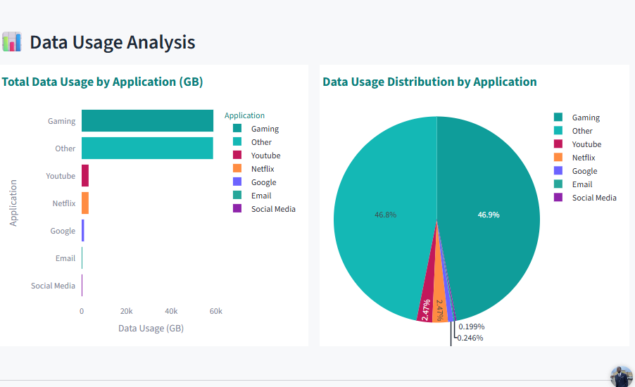
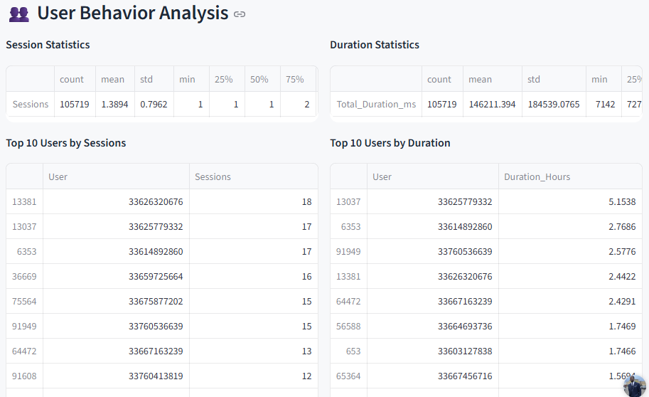
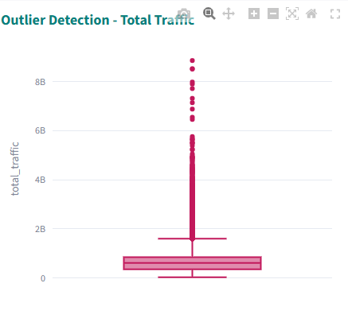

# 📊 Telecom User Behavior Analysis
 
 🚀 **Featured Project: Telecom Customer Usage Analytics Dashboard**
 
**Live App:**https://denis0242-telecom-analysis-app-odjz0z.streamlit.app

**GitHub:**[Telecom-User-Behavior-Analytics](https://github.com/Denis0242/Telecom_Analysis)

---

 

 

## 📌 Executive Summary
Exploratory data analysis of telecom user activity to uncover behavioral patterns, usage trends, and anomalies. This project serves as the **foundation layer** for understanding user behavior before building product analytics and predictive systems.

---

## 🎯 Business Problem
Telecom providers need to understand how users interact with services to:
- Identify high-usage behaviors
- Detect anomalies or inefficiencies
- Inform downstream analytics and modeling

---

## 📊 Dataset
- User sessions
- Call duration
- Data usage
- Device types
- Application traffic

---

## 📈 Key Metrics
- Session count
- Average session duration
- Data consumption per user
- Device distribution
- Traffic by application

---

## 🔍 Analysis
- Univariate and bivariate analysis
- Distribution analysis (usage patterns)
- Outlier detection
- Device and traffic segmentation

---

## 💡 Insights
- Heavy users contribute disproportionately to total traffic
- Certain applications dominate bandwidth usage
- Outliers indicate potential misuse or premium users

---

## 📊 Dashboard Features
- Interactive filtering (device, app, usage)
- Traffic distribution visualization
- Session behavior trends
  
---

## 📊 Dashboard Preview

###  Device Usage Breakdown

Analyzes user activity across different device types.

---
### User Activity Distribution

Shows distribution of user sessions and data usage to identify behavioral patterns.

---
### Outlier Detection

Identifies abnormal usage patterns for further investigation.

---

## ⚙️ Tools & Tech Stack
Python, Pandas, Plotly, Streamlit

---

## ▶️ How to Run
streamlit run app.py

-----

📁 Project Structure
Telecom_Analysis/
│── app.py
│── data/
│── notebooks/
│── README.md

----

## 📌 Author

**Denis Agyapong**  

